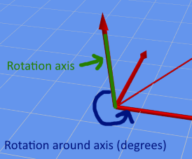
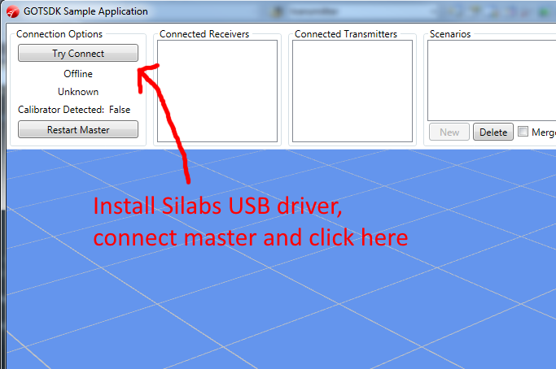
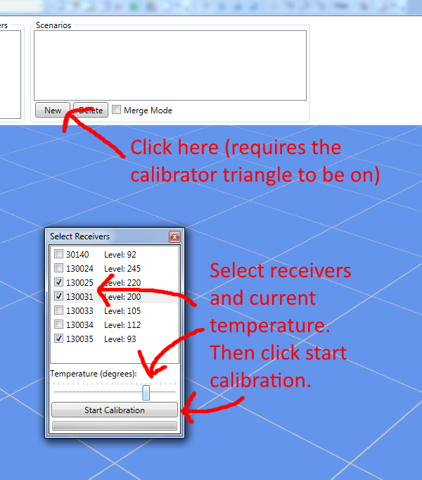
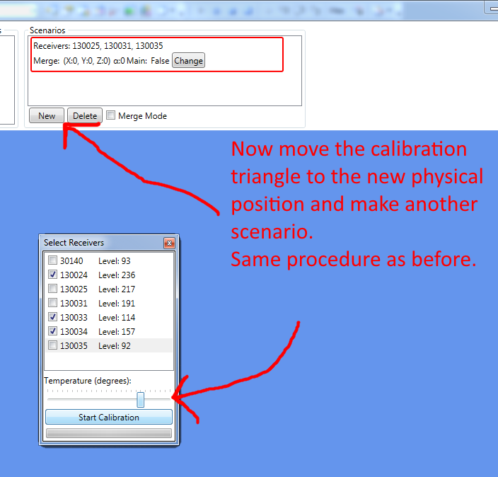
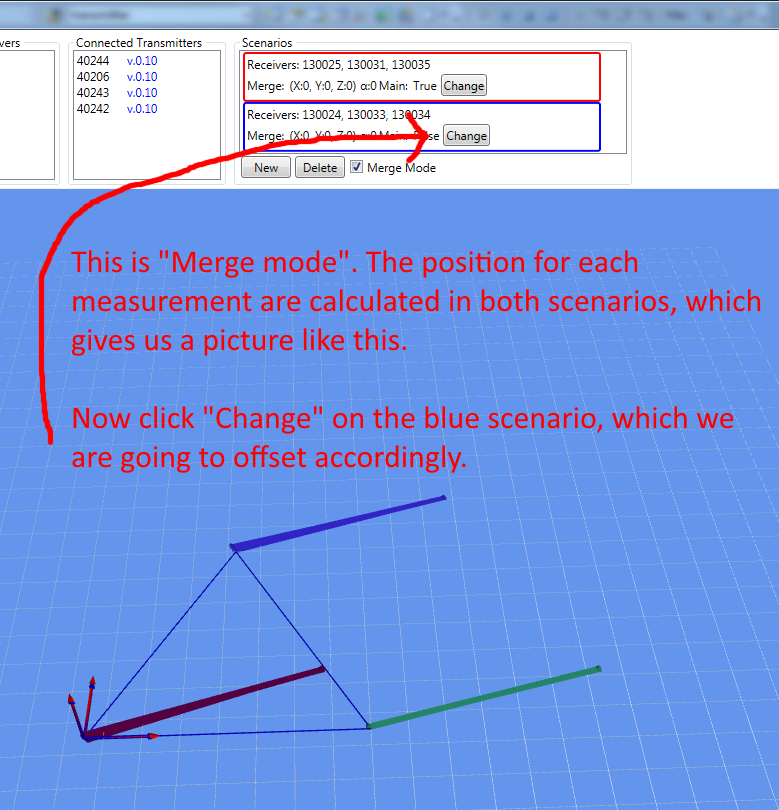

This document contains an overview of how to get started with the GamesOnTrack SDK. This document is intended for developers.

# SDK Requirements

For both developers and end-users:

* Third party Silabs USB driver for Master (can be found in the GOTSDK\Silabs folder)
* .NET framework 4.0 (Full, not client profile.) The is typically already installed, but can otherwise be downloaded [here](http://www.microsoft.com/en-us/download/details.aspx?id=17718). 
* The SDK does currently only run on Windows (and not Mono). The reason being the use of System.Management and System.Windows.Media namespaces, which has not yet been ported to Mono.

### Developers only: 
The GOTSDKSample project requires Visual Studio 2010 or newer (The free express version is good enough).

# SDK Library

The purpose of the SDK is to allow other developers to create applications using the GOT position system. The SDK is just a normal .NET class library, without any special dependencies. The library is used by the following produkct: GTCommand (by GamesOnTrack A/S) and Faller Car System Digital (by Faller GmbH).

The SDK library contains two overall parts: Master and Position

### Master:

Functionality for connecting to GOT Master. Essentially a class which manages the USB connection and raises events when new units are connected, measurements received and so on.

* New units (receivers and transmitters) are detected automatically.
* Measuring will begin automatically when the relevant units are connected.
* Current room temperature and measurement interval (usually 100 ms) can be set as parameters. Temperature is important. This is something the user of your application should provide.

### Position:

The raw data "output" from Master is pure distances in millimeters between transmitters and receivers. In order to get a more applicable (X,Y,Z) coordinate for a measurement, the distances need to go through a process called [Trilateration](http://en.wikipedia.org/wiki/Trilateration).

* The SDK uses a concept called "Scenarios" for that doing Trilateration. A helper class called "CalibratorTriangle" is used for automatically gathering the data needed. See the SDKSample for more details on how it works.
* A CalibratorTriangle is essentially a triangle with three transmitters and a known distance between all of them.
* Doing the calibration is only required once (unless the receives are moved around). It might be desirable to save the Calibration information and re-use that between application runs. See the class Scenario3DPersistence in the SDK Sample for an overview of how that can be implemented.

# SDKSample Application

### What is it?

* A WPF application showing the most basic usage of the GOTSDK.
* The focus is on providing a visualization on how the system works, including the necessary code for getting things up and running. 

### What can it do?

* Communication with the Master, including showing the connected units.
* Allows the user to create and calibrate Scenarios (using the supplied "calibrator triangle" device)
* Show measured positions in 3D

### How to use it?

* Install the Silabs USB driver (if not already done)
* Connect the Master via USB
* Run the application and click "Try Connect"
* The status labels just below the button should now show various data
* The connected transmitters and receivers will automatically populate the corresponding listboxes
* When a "auto-calibrator" has been found, the button labeled "New" under scenario will be enabled. Click the button to start calibrating a scenario.
* When a scenario has been calibrated, real-time data should show up in the panel: Receivers and latest measurements for transmitters.

# Scenario Merging

### The Merge Concept
In case you need more than one Scenario in your application, you need to "merge" them. The challenge is that all scenarios contain their own coordinate (local) system and we only want a single (global) coordinate system.

Our merge concept is basically about promoting one scenario to be the "main" scenario. This coordinate system of this scenario will now be origo of the global coordinate system. For each other scenario we need the offset between its coordinate system and the main scenario.

This is done by setting a number of properties on a Scenario instance. See further below. After that PositionCalculator.TryCalculatePositionFromMergedScenarios(...) will handle the rest.

### How to do it in code

The scenario class has the following relevant properties:

    // The offset vector. Often it is only necessary to set this.
    Vector3D ScenarioTranslation { get; set; }
    // The axis to rotate around. Only used in case the scenarios are not on a horizontal/level plane.
    Vector3D ScenarioRotationAxis { get; set; }
    // The angle in degrees to rotate around 'ScenarioRotationAxis'. This is only required if the scenarios are not parallel. 
    double ScenarioRotationAngle { get; set; }
    // Whether the scenario is a main scenario. Remark: Only one scenario should have this property set to true!
    bool IsMainScenario { get; set; }

And the following methods:

    // Get the full transform matrix, calculated from ScenarioTranslation, ScenarioRotationAxis and ScenarioRotationAngle.
    Matrix3D GetTransformMatrix();
    // Same as above, just inverted.
    Matrix3D GetInverseTransformMatrix();
    // Helper method for setting IsMainScenario = true and resetting all the transform properties
    void SetToMainScenario();

This rotation axis can be seen here:

# Example of merging in GOTSDKSample

  

  

  

  

  

  

  

  

  

  

  

  
